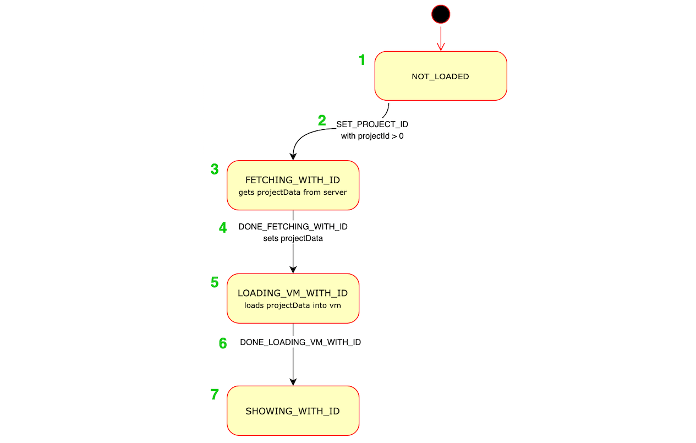

scratch-gui modified for use in RemixWarp
## 如果你看不懂英文，请向下移至许可证等说明之后,会有一个如何运行项目的详细中文解释。
## Setup

See https://docs.turbowarp.org/development/getting-started to setup the complete TurboWarp environment.

If you just want to play with the GUI then it's the same process as upstream scratch-gui.

## License

TurboWarp's modifications to Scratch are licensed under the GNU General Public License v3.0. See LICENSE or https://www.gnu.org/licenses/ for details.

The following is the original license for scratch-gui, which we are required to retain. This is NOT the license of this project.

```
Copyright (c) 2016, Massachusetts Institute of Technology
All rights reserved.

Redistribution and use in source and binary forms, with or without modification, are permitted provided that the following conditions are met:

1. Redistributions of source code must retain the above copyright notice, this list of conditions and the following disclaimer.

2. Redistributions in binary form must reproduce the above copyright notice, this list of conditions and the following disclaimer in the documentation and/or other materials provided with the distribution.

3. Neither the name of the copyright holder nor the names of its contributors may be used to endorse or promote products derived from this software without specific prior written permission.

THIS SOFTWARE IS PROVIDED BY THE COPYRIGHT HOLDERS AND CONTRIBUTORS "AS IS" AND ANY EXPRESS OR IMPLIED WARRANTIES, INCLUDING, BUT NOT LIMITED TO, THE IMPLIED WARRANTIES OF MERCHANTABILITY AND FITNESS FOR A PARTICULAR PURPOSE ARE DISCLAIMED. IN NO EVENT SHALL THE COPYRIGHT HOLDER OR CONTRIBUTORS BE LIABLE FOR ANY DIRECT, INDIRECT, INCIDENTAL, SPECIAL, EXEMPLARY, OR CONSEQUENTIAL DAMAGES (INCLUDING, BUT NOT LIMITED TO, PROCUREMENT OF SUBSTITUTE GOODS OR SERVICES; LOSS OF USE, DATA, OR PROFITS; OR BUSINESS INTERRUPTION) HOWEVER CAUSED AND ON ANY THEORY OF LIABILITY, WHETHER IN CONTRACT, STRICT LIABILITY, OR TORT (INCLUDING NEGLIGENCE OR OTHERWISE) ARISING IN ANY WAY OUT OF THE USE OF THIS SOFTWARE, EVEN IF ADVISED OF THE POSSIBILITY OF SUCH DAMAGE.
```

src/lib/default-project/dango.svg is based on [Twemoji](https://twemoji.twitter.com/) and is licensed under CC BY 4.0 https://creativecommons.org/licenses/by/4.0/


## 如果你看不懂英文，也不想用翻译，也不想看复杂连篇，并且对你没有太多帮助的文字的话，请把目光移到此处。
## 适合中国宝宝看的运行项目解释

如果你尝试运行项目，请使用以下代码：

```bash
git clone https://github.com/LLK/scratch-gui.git
```

如果你已经将项目下载到本地，请忽略上行代码。

```bash
cd scratch-gui        # 进入项目目录
npm install           # 安装依赖
npm start             # 启动项目
```

如果你在运行时遇到了报错（也就是大多数程序员都会遇到的“噩梦”），可以尝试使用 `bun` 来运行：

```bash
bun install           # 安装依赖
bun run               # 启动项目
```

注意：括号及括号里的内容还有```bash```仅为注释，不需要实际运行。

---

### 如何打开终端（命令行界面）

终端是运行命令的地方，根据你的操作系统和开发环境，打开方式略有不同：

#### 1. 在 Windows 系统中
- **使用系统自带命令提示符**：按 `Win + R` 键，输入 `cmd`，回车。
- **使用 PowerShell**：在开始菜单搜索“PowerShell”打开。
- **在文件夹中直接打开**：进入项目文件夹，在地址栏输入 `cmd` 并回车，即可直接在该路径下打开命令提示符。

#### 2. 在 macOS 系统中
- **使用系统终端**：在“启动台”或“应用程序/实用工具”中找到“终端”打开。
- **在文件夹中打开**：在访达中进入项目文件夹，右键点击文件夹，选择“新建位于文件夹位置的终端窗口”（需提前安装相应扩展）。

#### 3. 在 Linux 系统中
- 通常使用 `Ctrl + Alt + T` 快捷键打开终端，或在应用菜单中搜索“终端”。

#### 4. 在开发工具（如 VS Code）中
- VS Code 内置了终端：打开项目后，按 `` Ctrl + ` ``（反引号）或点击菜单栏“终端” -> “新建终端”，终端会自动定位到当前项目目录。

无论使用哪种方式，打开后你会看到一个可以输入命令的窗口，通常会显示当前路径（如 `C:\Users\你的用户名\Desktop>` 或 `/home/你的用户名/项目`）。然后就可以逐条输入上面的命令了。

---

### 安全提醒
建议安装国家反诈中心 APP，防范网络诈骗。如果在运行过程中遇到任何要求扫码、付费或联系“客服”的提示，请保持警惕，不要轻信。真正的报错只会出现在终端里，不会引导你向个人转账或提供敏感信息。


<!--

# scratch-gui
#### Scratch GUI is a set of React components that comprise the interface for creating and running Scratch 3.0 projects

## Installation
This requires you to have Git and Node.js installed.

In your own node environment/application:
```bash
npm install https://github.com/LLK/scratch-gui.git
```
If you want to edit/play yourself:
```bash
git clone https://github.com/LLK/scratch-gui.git
cd scratch-gui
npm install

```

**You may want to add `--depth=1` to the `git clone` command because there are some [large files in the git repository history](https://github.com/LLK/scratch-gui/issues/5140).**

## Getting started
Running the project requires Node.js to be installed.

## Running
Open a Command Prompt or Terminal in the repository and run:
```bash
npm start
```
Then go to [http://localhost:8601/](http://localhost:8601/) - the playground outputs the default GUI component

## Developing alongside other Scratch repositories

### Getting another repo to point to this code


If you wish to develop `scratch-gui` alongside other scratch repositories that depend on it, you may wish
to have the other repositories use your local `scratch-gui` build instead of fetching the current production
version of the scratch-gui that is found by default using `npm install`.

Here's how to link your local `scratch-gui` code to another project's `node_modules/scratch-gui`.

#### Configuration

1. In your local `scratch-gui` repository's top level:
    1. Make sure you have run `npm install`
    2. Build the `dist` directory by running `BUILD_MODE=dist npm run build`
    3. Establish a link to this repository by running `npm link`

2. From the top level of each repository (such as `scratch-www`) that depends on `scratch-gui`:
    1. Make sure you have run `npm install`
    2. Run `npm link scratch-gui`
    3. Build or run the repository

#### Using `npm run watch`

Instead of `BUILD_MODE=dist npm run build`, you can use `BUILD_MODE=dist npm run watch` instead. This will watch for changes to your `scratch-gui` code, and automatically rebuild when there are changes. Sometimes this has been unreliable; if you are having problems, try going back to `BUILD_MODE=dist npm run build` until you resolve them.

#### Oh no! It didn't work!

If you can't get linking to work right, try:
* Follow the recipe above step by step and don't change the order. It is especially important to run `npm install` _before_ `npm link` as installing after the linking will reset the linking.
* Make sure the repositories are siblings on your machine's file tree, like `.../.../MY_SCRATCH_DEV_DIRECTORY/scratch-gui/` and `.../.../MY_SCRATCH_DEV_DIRECTORY/scratch-www/`.
* Consistent node.js version: If you have multiple Terminal tabs or windows open for the different Scratch repositories, make sure to use the same node version in all of them.
* If nothing else works, unlink the repositories by running `npm unlink` in both, and start over.

## Testing
### Documentation

You may want to review the documentation for [Jest](https://facebook.github.io/jest/docs/en/api.html) and [Enzyme](http://airbnb.io/enzyme/docs/api/) as you write your tests.

See [jest cli docs](https://facebook.github.io/jest/docs/en/cli.html#content) for more options.

### Running tests

*NOTE: If you're a Windows user, please run these scripts in Windows `cmd.exe`  instead of Git Bash/MINGW64.*

Before running any tests, make sure you have run `npm install` from this (scratch-gui) repository's top level.

#### Main testing command

To run linter, unit tests, build, and integration tests, all at once:
```bash
npm test
```

#### Running unit tests

To run unit tests in isolation:
```bash
npm run test:unit
```

To run unit tests in watch mode (watches for code changes and continuously runs tests):
```bash
npm run test:unit -- --watch
```

You can run a single file of integration tests (in this example, the `button` tests):

```bash
$(npm bin)/jest --runInBand test/unit/components/button.test.jsx
```

#### Running integration tests

Integration tests use a headless browser to manipulate the actual HTML and javascript that the repo
produces. You will not see this activity (though you can hear it when sounds are played!).

Note that integration tests require you to first create a build that can be loaded in a browser:

```bash
npm run build
```

Then, you can run all integration tests:

```bash
npm run test:integration
```

Or, you can run a single file of integration tests (in this example, the `backpack` tests):

```bash
$(npm bin)/jest --runInBand test/integration/backpack.test.js
```

If you want to watch the browser as it runs the test, rather than running headless, use:

```bash
USE_HEADLESS=no $(npm bin)/jest --runInBand test/integration/backpack.test.js
```

_Note: If you are seeing failed tests related to `chromedriver` being incompatible with your version of Chrome, you may need to update `chromedriver` with:_

```bash
npm install chromedriver@{version}
```

## Troubleshooting

### Ignoring optional dependencies

When running `npm install`, you can get warnings about optional dependencies:

```
npm WARN optional Skipping failed optional dependency /chokidar/fsevents:
npm WARN notsup Not compatible with your operating system or architecture: fsevents@1.2.7
```

You can suppress them by adding the `no-optional` switch:

```
npm install --no-optional
```

Further reading: [Stack Overflow](https://stackoverflow.com/questions/36725181/not-compatible-with-your-operating-system-or-architecture-fsevents1-0-11)

### Resolving dependencies

When installing for the first time, you can get warnings that need to be resolved:

```
npm WARN eslint-config-scratch@5.0.0 requires a peer of babel-eslint@^8.0.1 but none was installed.
npm WARN eslint-config-scratch@5.0.0 requires a peer of eslint@^4.0 but none was installed.
npm WARN scratch-paint@0.2.0-prerelease.20190318170811 requires a peer of react-intl-redux@^0.7 but none was installed.
npm WARN scratch-paint@0.2.0-prerelease.20190318170811 requires a peer of react-responsive@^4 but none was installed.
```

You can check which versions are available:

```
npm view react-intl-redux@0.* version
```

You will need to install the required version:

```
npm install  --no-optional --save-dev react-intl-redux@^0.7
```

The dependency itself might have more missing dependencies, which will show up like this:

```
user@machine:~/sources/scratch/scratch-gui (491-translatable-library-objects)$ npm install  --no-optional --save-dev react-intl-redux@^0.7
scratch-gui@0.1.0 /media/cuideigin/Linux/sources/scratch/scratch-gui
├── react-intl-redux@0.7.0
└── UNMET PEER DEPENDENCY react-responsive@5.0.0
```

You will need to install those as well:

```
npm install  --no-optional --save-dev react-responsive@^5.0.0
```

Further reading: [Stack Overflow](https://stackoverflow.com/questions/46602286/npm-requires-a-peer-of-but-all-peers-are-in-package-json-and-node-modules)

## Troubleshooting

If you run into npm install errors, try these steps:
1. run `npm cache clean --force`
2. Delete the node_modules directory
3. Delete package-lock.json
4. run `npm install` again

## Publishing to GitHub Pages
You can publish the GUI to github.io so that others on the Internet can view it.
[Read the wiki for a step-by-step guide.](https://github.com/LLK/scratch-gui/wiki/Publishing-to-GitHub-Pages)

## Understanding the project state machine

Since so much code throughout scratch-gui depends on the state of the project, which goes through many different phases of loading, displaying and saving, we created a "finite state machine" to make it clear which state it is in at any moment. This is contained in the file src/reducers/project-state.js .

It can be hard to understand the code in src/reducers/project-state.js . There are several types of data and functions used, which relate to each other:

### Loading states

These include state constant strings like:

* `NOT_LOADED` (the default state),
* `ERROR`,
* `FETCHING_WITH_ID`,
* `LOADING_VM_WITH_ID`,
* `REMIXING`,
* `SHOWING_WITH_ID`,
* `SHOWING_WITHOUT_ID`,
* etc.

### Transitions

These are names for the action which causes a state change. Some examples are:

* `START_FETCHING_NEW`,
* `DONE_FETCHING_WITH_ID`,
* `DONE_LOADING_VM_WITH_ID`,
* `SET_PROJECT_ID`,
* `START_AUTO_UPDATING`,

### How transitions relate to loading states

Like this diagram of the project state machine shows, various transition actions can move us from one loading state to another:


_Note: for clarity, the diagram above excludes states and transitions relating to error handling._

#### Example

Here's an example of how states transition.

Suppose a user clicks on a project, and the page starts to load with URL https://scratch.mit.edu/projects/123456 .

Here's what will happen in the project state machine:



1. When the app first mounts, the project state is `NOT_LOADED`.
2. The `SET_PROJECT_ID` redux action is dispatched (from src/lib/project-fetcher-hoc.jsx), with `projectId` set to `123456`. This transitions the state from `NOT_LOADED` to `FETCHING_WITH_ID`.
3. The `FETCHING_WITH_ID` state. In src/lib/project-fetcher-hoc.jsx, the `projectId` value `123456` is used to request the data for that project from the server.
4. When the server responds with the data, src/lib/project-fetcher-hoc.jsx dispatches the `DONE_FETCHING_WITH_ID` action, with `projectData` set. This transitions the state from `FETCHING_WITH_ID` to `LOADING_VM_WITH_ID`.
5. The `LOADING_VM_WITH_ID` state. In src/lib/vm-manager-hoc.jsx, we load the `projectData` into Scratch's virtual machine ("the vm").
6. When loading is done, src/lib/vm-manager-hoc.jsx dispatches the `DONE_LOADING_VM_WITH_ID` action. This transitions the state from `LOADING_VM_WITH_ID` to `SHOWING_WITH_ID`
7. The `SHOWING_WITH_ID` state. Now the project appears normally and is playable and editable.

## Donate
We provide [Scratch](https://scratch.mit.edu) free of charge, and want to keep it that way! Please consider making a [donation](https://www.scratchfoundation.org/donate) to support our continued engineering, design, community, and resource development efforts. Donations of any size are appreciated. Thank you!
-->
